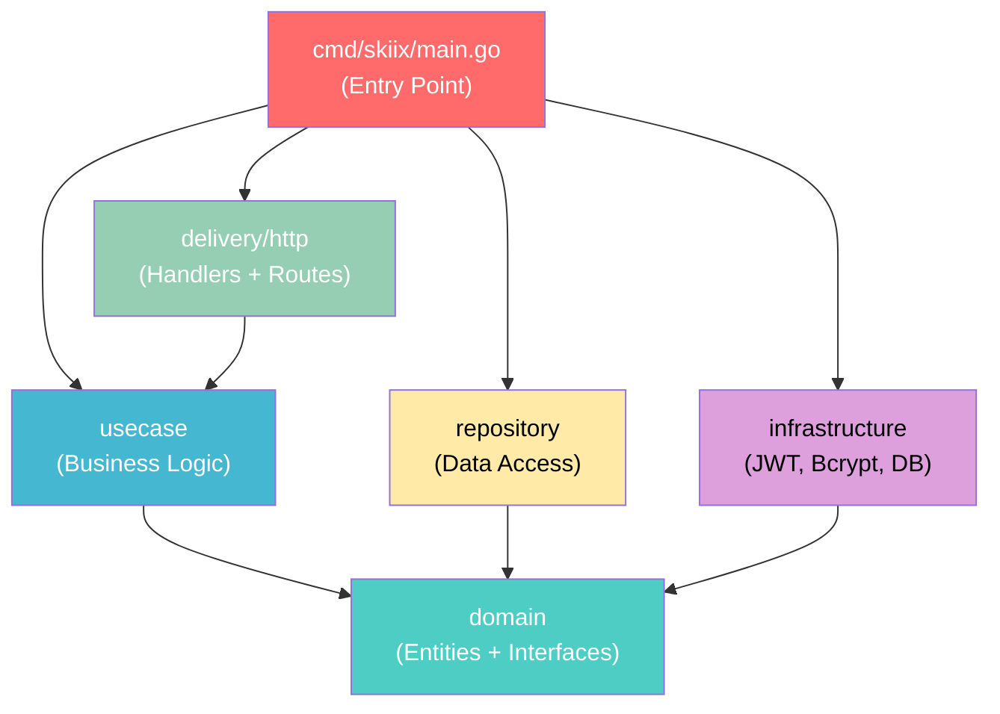
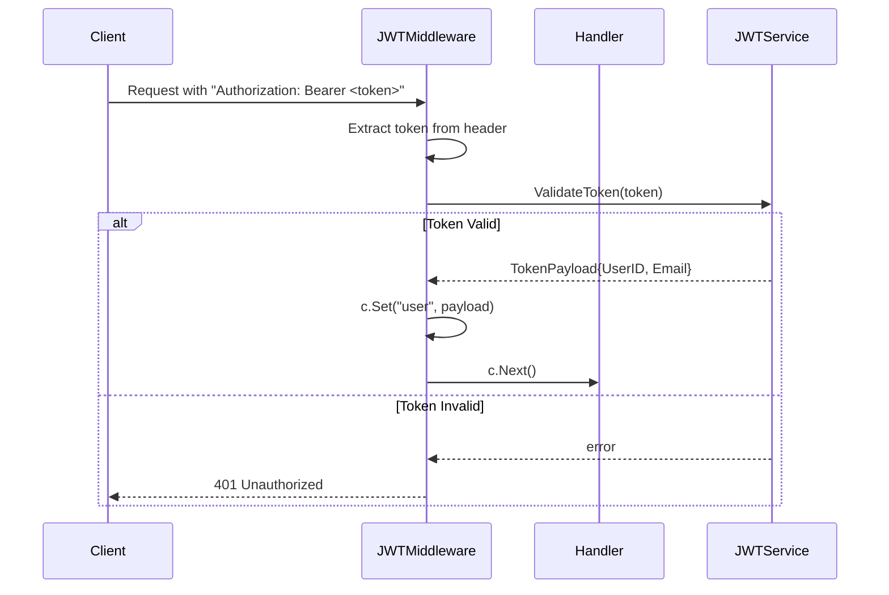
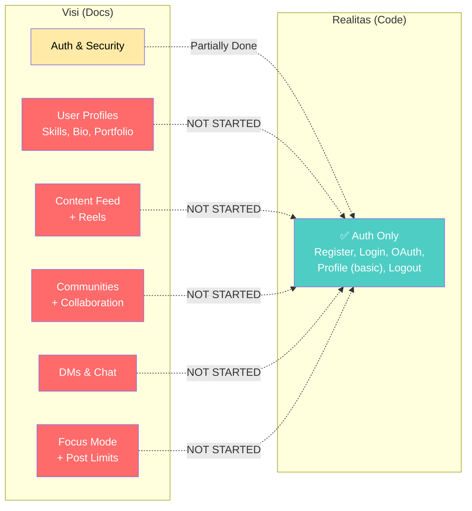
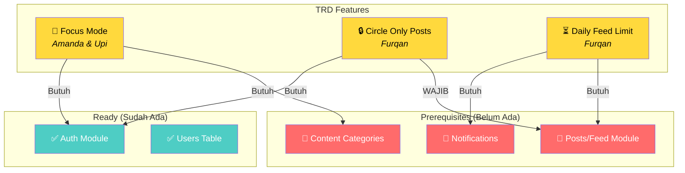

# 🔍 Deep Analysis — Skiix Backend

> **Repository**: [github.com/xinnxz/skiix-backend](https://github.com/xinnxz/skiix-backend)  
> **Branch Aktif**: `feature/authentication` (satu-satunya branch, juga sebagai HEAD default)  
> **Bahasa**: Go 1.26.1  
> **Tanggal Analisis**: 10 April 2026

---

## 📋 Daftar Isi

1. [Ringkasan Eksekutif](#-ringkasan-eksekutif)
2. [Arsitektur & Struktur Project](#-arsitektur--struktur-project)
3. [Breakdown Setiap Layer](#-breakdown-setiap-layer)
4. [API Endpoints](#-api-endpoints)
5. [Database Schema](#-database-schema)
6. [Dependency Analysis](#-dependency-analysis)
7. [Dokumentasi (Folder docs/)](#-dokumentasi-folder-docs)
8. [Testing & Coverage](#-testing--coverage)
9. [Security Audit](#-security-audit)
10. [Code Quality & Patterns](#-code-quality--patterns)
11. [Temuan & Rekomendasi Perbaikan](#-temuan--rekomendasi-perbaikan)
12. [Kesimpulan](#-kesimpulan)

---

## 🎯 Ringkasan Eksekutif

**Skiix** adalah backend API yang dibangun menggunakan **Go** dengan arsitektur **Clean Architecture**. Saat ini project ini masih dalam tahap **early development** — baru mengimplementasikan satu modul yaitu **Authentication** (Register, Login, Logout, Profile, dan Google OAuth).

| Aspek | Status |
|-------|--------|
| **Maturity** | 🟡 Early Stage (MVP Authentication) |
| **Architecture** | 🟢 Clean Architecture yang baik |
| **Test Coverage** | 🟢 Usecase layer tercover 100% |
| **API Documentation** | 🟢 Swagger auto-generated tersedia |
| **Security** | 🟡 Perlu beberapa perbaikan |
| **Production Readiness** | 🔴 Belum siap production |

---

## 🏗 Arsitektur & Struktur Project

Project ini menggunakan pola **Clean Architecture** yang populer di ekosistem Go. Arsitektur ini memisahkan concern ke dalam layer-layer yang independen, sehingga mudah di-test dan di-maintain.

```
skiix-backend/
├── cmd/skiix/                          # 🚀 ENTRY POINT
│   └── main.go                         # Bootstrap: load env, init DB, wire dependencies, start server
│
├── internal/                           # 🔒 PRIVATE APPLICATION CODE
│   ├── domain/                         # 📐 LAYER 1: Core Business Entities & Interfaces
│   │   ├── user.go                     # User struct + UserRepository interface
│   │   └── auth.go                     # TokenPayload struct + JWTService interface
│   │
│   ├── usecase/                        # 🧠 LAYER 2: Business Logic
│   │   ├── auth.go                     # AuthUsecase interface + implementation
│   │   └── auth_test.go                # ✅ 708 lines of unit tests!
│   │
│   ├── repository/                     # 💾 LAYER 3: Data Access
│   │   └── user.go                     # PostgresUserRepository (SQL queries)
│   │
│   ├── delivery/http/                  # 🌐 LAYER 4: HTTP Transport
│   │   ├── auth_handler.go             # Handler functions (Register, Login, Logout, GetProfile)
│   │   ├── oauth_handler.go            # Google OAuth handler
│   │   ├── middleware.go               # JWT authentication middleware
│   │   └── routes.go                   # Route registration + ProfileResponse DTO
│   │
│   └── infrastructure/                 # ⚙️ LAYER 5: External Services
│       ├── database.go                 # PostgreSQL connection manager
│       ├── jwt_service.go              # JWT token generation & validation (HS256)
│       └── password_service.go         # Bcrypt password hashing & verification
│
├── pkg/migration/                      # 📦 PUBLIC PACKAGE
│   └── migration.go                    # Auto-migration (CREATE TABLE IF NOT EXISTS)
│
├── docs/                               # 📖 DOCUMENTATION
│   ├── docs.go                         # Swagger auto-generated Go code
│   ├── swagger.json                    # OpenAPI 2.0 spec (JSON)
│   ├── swagger.yaml                    # OpenAPI 2.0 spec (YAML)
│   ├── Skiix_Documentation.pdf         # Project documentation PDF
│   ├── Skiix – Project Documentation (global Launch).pdf
│   └── Founders Agreement (4).pdf      # Founders agreement document
│
├── docker-compose.yml                  # PostgreSQL 16 Alpine container
├── .env.example                        # Environment variable template
├── go.mod / go.sum                     # Go module management
└── README.md                           # Quick start guide
```

### Visualisasi Dependency Flow (Clean Architecture)



> [!NOTE]
> **Penjelasan**: Panah menunjukkan arah dependency. Perhatikan bahwa `domain` (layer paling dalam) **tidak bergantung pada layer lain** — ini adalah prinsip inti Clean Architecture. Semua layer luar bergantung pada domain melalui **interfaces**, bukan concrete implementations.

---

## 📂 Breakdown Setiap Layer

### 1. Domain Layer — `internal/domain/`

**Fungsi**: Mendefinisikan **entities** (struct data) dan **interfaces** (kontrak) yang menjadi inti bisnis logic.

#### [user.go](file:///e:/DATA/Ngoding/skiix-backend/internal/domain/user.go)

```go
type User struct {
    ID        string    `json:"id"`
    Email     string    `json:"email"`
    Password  *string   `json:"-"`          // pointer → nullable, json:"-" → tidak ikut di-serialize
    Provider  *string   `json:"provider,omitempty"` // "local" atau "google"
    CreatedAt time.Time `json:"created_at"`
    UpdatedAt time.Time `json:"updated_at"`
}

type UserRepository interface {
    Create(user *User) error
    FindByEmail(email string) (*User, error)
    FindByID(id string) (*User, error)
}
```

> [!TIP]
> **Kenapa `Password` pakai pointer `*string`?**  
> Karena user OAuth (Google login) tidak punya password. Dengan pointer, field ini bisa bernilai `nil` (NULL di database), berbeda dengan string kosong `""`. Ini adalah pattern yang tepat untuk nullable fields di Go.

#### [auth.go](file:///e:/DATA/Ngoding/skiix-backend/internal/domain/auth.go)

```go
type TokenPayload struct {
    UserID string
    Email  string
}

type JWTService interface {
    GenerateToken(payload *TokenPayload) (string, error)
    ValidateToken(token string) (*TokenPayload, error)
}
```

> [!NOTE]
> **Interface Segregation**: `JWTService` didefinisikan di domain layer, bukan di infrastructure. Ini artinya usecase layer hanya "tahu" interface-nya, tidak tahu implementasi JWT yang sebenarnya. Sangat bagus untuk testability — kita bisa mock `JWTService` saat testing.

---

### 2. Usecase Layer — `internal/usecase/`

**Fungsi**: Menampung **semua business logic** aplikasi. Layer ini orchestrate antara domain entities, repository, dan infrastructure services.

#### [auth.go](file:///e:/DATA/Ngoding/skiix-backend/internal/usecase/auth.go) — 167 lines

| Method | Deskripsi | Validasi |
|--------|-----------|----------|
| `Register(email, password)` | Daftar user baru (local) | Email tidak boleh kosong/terlalu panjang, password min 6 karakter |
| `Login(email, password)` | Login dan return JWT token | Cek email exists, verify password hash |
| `OAuthLogin(email, provider)` | Login via Google OAuth | Auto-create user jika belum ada |
| `Logout(userID)` | Logout user | Hanya validasi userID tidak kosong |
| `GetProfile(userID)` | Ambil data profil user | Cari user by ID |

> [!IMPORTANT]
> **Temuan: Logout belum benar-benar invalidate token.**  
> Method `Logout()` hanya return `nil` (sukses) tanpa melakukan apa-apa. Ini berarti token JWT tetap valid sampai expired. Untuk production, perlu implementasi **token blacklist** (misalnya pakai Redis) atau **token versioning**.

---

### 3. Repository Layer — `internal/repository/`

**Fungsi**: Implementasi akses ke database PostgreSQL menggunakan **raw SQL queries** (tanpa ORM).

#### [user.go](file:///e:/DATA/Ngoding/skiix-backend/internal/repository/user.go) — 95 lines

| Method | SQL Query | Error Handling |
|--------|-----------|----------------|
| `Create()` | `INSERT INTO users ...` | Handle duplicate email constraint |
| `FindByEmail()` | `SELECT ... WHERE email = $1` | Handle `sql.ErrNoRows` |
| `FindByID()` | `SELECT ... WHERE id = $1` | Handle `sql.ErrNoRows` |

> [!TIP]
> **Bagus**: Menggunakan **parameterized queries** (`$1`, `$2`, dst.) yang aman dari SQL Injection. Ini adalah best practice yang wajib diikuti.

> [!WARNING]
> **Peringatan**: Error string comparison untuk duplicate key (`err.Error() == "pq: duplicate key value..."`) bersifat **fragile** — bisa break jika driver pq mengubah format error. Sebaiknya gunakan **error type assertion** dari package `lib/pq`.

---

### 4. Delivery Layer — `internal/delivery/http/`

**Fungsi**: HTTP handlers yang menerima request, parsing input, memanggil usecase, dan mengembalikan response.

#### File-file dalam layer ini:

| File | Fungsi | Lines |
|------|--------|-------|
| [auth_handler.go](file:///e:/DATA/Ngoding/skiix-backend/internal/delivery/http/auth_handler.go) | Handler untuk Register, Login, Logout, GetProfile | 170 |
| [oauth_handler.go](file:///e:/DATA/Ngoding/skiix-backend/internal/delivery/http/oauth_handler.go) | Google OAuth handler (initiate + callback) | 48 |
| [middleware.go](file:///e:/DATA/Ngoding/skiix-backend/internal/delivery/http/middleware.go) | JWT auth middleware | 42 |
| [routes.go](file:///e:/DATA/Ngoding/skiix-backend/internal/delivery/http/routes.go) | Route registration + ProfileResponse DTO | 35 |

**Middleware JWT Flow**:


---

### 5. Infrastructure Layer — `internal/infrastructure/`

**Fungsi**: Implementasi teknis yang "kotor" — koneksi database, JWT signing, password hashing.

| File | Teknologi | Detail |
|------|-----------|--------|
| [database.go](file:///e:/DATA/Ngoding/skiix-backend/internal/infrastructure/database.go) | PostgreSQL via `lib/pq` | MaxOpenConns=25, MaxIdleConns=5, ConnMaxLifetime=5min |
| [jwt_service.go](file:///e:/DATA/Ngoding/skiix-backend/internal/infrastructure/jwt_service.go) | `golang-jwt/jwt/v5`, HS256 | Token expiry: 24 jam |
| [password_service.go](file:///e:/DATA/Ngoding/skiix-backend/internal/infrastructure/password_service.go) | `bcrypt` (DefaultCost=10) | Standard bcrypt hashing |

> [!NOTE]
> **Database Connection Pooling** sudah dikonfigurasi dengan baik:
> - `MaxOpenConns(25)` — maksimal 25 koneksi aktif secara bersamaan
> - `MaxIdleConns(5)` — 5 koneksi idle siap pakai (mengurangi latency)
> - `ConnMaxLifetime(5min)` — koneksi di-recycle setiap 5 menit (mencegah stale connections)

---

## 🌐 API Endpoints

Berikut inventory lengkap semua endpoint yang tersedia:

| Method | Path | Auth | Deskripsi | Request Body | Response |
|--------|------|------|-----------|--------------|----------|
| `POST` | `/auth/register` | ❌ | Daftar user baru | `{email, password}` | `201` + message |
| `POST` | `/auth/login` | ❌ | Login & dapatkan token | `{email, password}` | `200` + JWT token |
| `POST` | `/auth/logout` | ✅ Bearer | Logout user | — | `200` + message |
| `GET` | `/auth/profile` | ✅ Bearer | Lihat profil user | — | `200` + user data |
| `GET` | `/auth/google` | ❌ | Redirect ke Google OAuth | — | `302` redirect |
| `GET` | `/auth/google/callback` | ❌ | Callback dari Google | — | `200` + JWT token |
| `GET` | `/swagger/*any` | ❌ | Swagger UI docs | — | HTML |
| `GET` | `/docs` | ❌ | Redirect ke Swagger UI | — | `302` redirect |

---

## 💾 Database Schema

Saat ini hanya ada **1 tabel** yang dibuat via auto-migration:

```sql
CREATE TABLE IF NOT EXISTS users (
    id         VARCHAR(36) PRIMARY KEY,      -- UUID v4 string
    email      VARCHAR(254) UNIQUE NOT NULL,  -- RFC 5321 max email length
    password   VARCHAR(255),                  -- Nullable (NULL untuk OAuth users)
    provider   VARCHAR(50),                   -- "local" atau "google"
    created_at TIMESTAMP NOT NULL,
    updated_at TIMESTAMP NOT NULL
);
```

> [!NOTE]
> **Tentang Migration**: Project ini menggunakan pendekatan **auto-migration** sederhana (`CREATE TABLE IF NOT EXISTS`). Ini cukup untuk development, tapi untuk production sebaiknya gunakan migration tool proper seperti `golang-migrate` atau `goose` yang mendukung **versioning** dan **rollback**.

---

## 📦 Dependency Analysis

### Direct Dependencies (go.mod)

| Package | Versi | Fungsi |
|---------|-------|--------|
| `gin-gonic/gin` | v1.12.0 | HTTP web framework (routing, middleware, binding) |
| `golang-jwt/jwt/v5` | v5.3.1 | JWT token generation & validation |
| `google/uuid` | v1.6.0 | UUID v4 generation untuk user ID |
| `joho/godotenv` | v1.5.1 | Load `.env` file ke environment variables |
| `lib/pq` | v1.10.9 | PostgreSQL driver untuk `database/sql` |
| `markbates/goth` | v1.82.0 | Multi-provider OAuth library (Google) |
| `stretchr/testify` | v1.11.1 | Testing utilities (assert, mock) |
| `swaggo/swag` | v1.16.6 | Swagger documentation auto-generation |
| `swaggo/gin-swagger` | v1.6.1 | Swagger UI middleware untuk Gin |
| `swaggo/files` | v1.0.1 | Static file serving untuk Swagger UI |
| `golang.org/x/crypto` | v0.49.0 | Bcrypt password hashing |

> [!TIP]
> **Dependency stack ini sangat standard dan well-maintained**. Semua package yang digunakan adalah pilihan populer dan battle-tested di ekosistem Go. Tidak ada dependency yang "exotic" atau berisiko.

### Catatan Khusus

Ada block `replace` di `go.mod` yang mengalihkan import path:
```go
replace (
    github.com/skiix-backend/internal/delivery/http => ./internal/delivery/http
    github.com/skiix-backend/internal/usecase => ./internal/usecase
)
```

> [!WARNING]
> **`replace` directives ini seharusnya tidak diperlukan** untuk project yang menggunakan module path `github.com/skiix-backend`. Mereka biasanya muncul dari kesalahan konfigurasi Go modules. Jika import path konsisten, bisa dihapus.

---

## 📖 Dokumentasi (Folder docs/)

### 1. Auto-Generated Swagger Docs
- **docs.go** — Go code auto-generated oleh `swag init` berisi template JSON Swagger spec
- **swagger.json** — OpenAPI 2.0 spec dalam format JSON (10KB)
- **swagger.yaml** — OpenAPI 2.0 spec dalam format YAML (5KB)
- Accessible di runtime via `http://localhost:8080/docs` → redirect ke `/swagger/index.html`

**Kualitas Swagger**: ✅ Cukup lengkap. Semua endpoint terdokumentasi dengan request/response schemas, examples, dan security definitions.

### 2. PDF Documents — Isi Lengkap

---

#### 📄 Skiix_Documentation.pdf (v1.0 — Internal & Confidential)

Dokumen ini menjelaskan **visi awal** Skiix:

> *"We built Skiix because we were tired of apps that hijack your time. It's a social media platform that actually respects how you want to use it."*

**Core Features yang direncanakan:**

| Feature | Deskripsi |
|---------|-----------|
| 🧘 **Focus Mode** | Toggle untuk mematikan feed. Masih bisa post & DM, tapi tidak terseret scrolling |
| 📝 **Daily Post Limit** | Opsional — user bisa on/off kapan saja. Menjaga feed tetap intentional |
| 🔘 **Feed Button** | Feed BUKAN hal pertama saat buka app. Harus tap dulu secara sengaja |
| 🎨 **Clean Profile & Posts** | Profil dan post minimal — likes ada tapi tanpa clutter |
| 💬 **Direct Messaging** | Chat private antar user |

**Tech Stack yang tertulis di doc v1:**

| Layer | Teknologi | Catatan |
|-------|-----------|---------|
| Frontend | React Native | Cross-platform iOS & Android |
| Backend | **Node.js + Express** | ⚠️ **BERBEDA dengan implementasi aktual (Go + Gin)!** |
| Database | **PostgreSQL (Supabase)** | ⚠️ Backend aktual pakai PostgreSQL langsung (tanpa Supabase) |
| Real-time | Supabase | Belum diimplementasi |
| Auth | Supabase Auth | Backend aktual pakai custom JWT + Google OAuth |
| Storage | Supabase Storage | Belum diimplementasi |

> [!WARNING]
> **Gap Signifikan**: Dokumentasi v1 menyebut tech stack **Node.js + Supabase**, tapi backend aktual menggunakan **Go + Gin + raw PostgreSQL**. Ini menunjukkan ada **pivot teknologi** yang terjadi setelah dokumen ini ditulis, tapi dokumen belum di-update.

---

#### 📄 Skiix – Project Documentation (Global Launch).pdf

Dokumen ini adalah **versi yang lebih ambisius** — menggambarkan Skiix sebagai platform global:

**Visi**: *"To become a global hub where ideas meet execution and people collaborate beyond borders."*

**Misi**:
- Empower creators, builders, dan learners worldwide
- Jadikan kolaborasi simple, visual, dan engaging
- Ubah inspirasi menjadi aksi nyata

**Target Audience**: Startup founders, developers, designers, marketers, students, early professionals

**Fitur yang Direncanakan (lebih lengkap dari doc v1):**

| Feature | Status di Backend |
|---------|-------------------|
| User Profiles (bio, skills, portfolio links) | 🔴 Belum ada — hanya email & provider |
| Communities (join/create) | 🔴 Belum ada |
| Collaboration on ideas/projects | 🔴 Belum ada |
| Comments, likes, shares | 🔴 Belum ada |
| Personalized content feed | 🔴 Belum ada |
| **Skiix Reels** (short-video) | 🔴 Belum ada |
| Global & local discovery | 🔴 Belum ada |

**Roadmap:**

| Phase | Target | Status |
|-------|--------|--------|
| Phase 1 — Launch | Core app, Reels, Community | 🔴 Baru auth saja |
| Phase 2 — Growth | Creator tools, Analytics, Monetization | 🔴 Belum |
| Phase 3 — Scale | AI recommendations, Advanced collab, Wearables | 🔴 Belum |

**Monetization**: Creator monetization, brand partnerships, premium community tools, enterprise features.

**Security & Privacy**: Secure auth, data encryption, content moderation, community reporting.

> [!IMPORTANT]
> **Realitas vs Visi**: Dokumentasi global launch menggambarkan Skiix sebagai social platform **full-featured** (reels, communities, feeds, collaboration). Namun backend saat ini **hanya memiliki authentication**. Gap ini sangat besar — estimasi masih butuh **banyak modul** lagi: User Profile, Posts/Feed, Communities, Reels, DMs, Notifications, File Storage, dll.

---

#### 📄 Founders Agreement (4).pdf

Dokumen legal yang mengatur **equity distribution** antar anggota tim:

| Nama | Role | Equity | Catatan |
|------|------|--------|---------|
| Ashhad | CEO | 15% | Founder utama |
| Abdullah | Founder 2 | 12.5% | — |
| Omar | Founder 3 | 12.5% | — |
| Zufar | Founder 4 | 11% | — |
| Furkan | Team Member | 7% | — |
| Micheal | Team Member | 5% | — |
| Juan | Team Member | 5% | — |
| Upi (Amanda) | Team Member | 5% | Nama internal "Amanda" — cocok dengan comment di `.env.example` |
| Huzaifa | Team Member | 5% | — |
| Future Pool | — | 13% | Untuk hiring di masa depan |
| Investor | — | 9% | Reserved untuk investor |
| **Total** | | **100%** | |

**Vesting Schedule**:
- **Cliff period**: 1 tahun (tidak dapat equity jika keluar sebelum 1 tahun)
- **Vesting**: 25% setelah tahun pertama, sisanya vesting annual selama 4–5 tahun
- Contoh: 5% equity → 1.25% vest tiap tahun selama 4 tahun

> [!CAUTION]
> **File legal TIDAK seharusnya ada di repository code.** Ini mengandung informasi sensitif (equity percentages, nama anggota tim). Sangat disarankan untuk:
> 1. **Hapus dari git history** menggunakan `git filter-branch` atau `BFG Repo-Cleaner`
> 2. Simpan di tempat aman (Google Drive dengan restricted access, atau legal platform)
> 3. Tambahkan ke `.gitignore`

---

### 3. Analisis Gap: Dokumentasi vs Implementasi



> **Kesimpulan dari docs**: Project punya visi besar sebagai social platform anti-addictive, tapi implementasi backend baru ~5% dari total fitur yang direncanakan. Juga ada inkonsistensi tech stack antara doc v1 (Node.js) dan kode aktual (Go).

---

### 4. TRD (Technical Requirements Documents) — dari Notion

> 📎 Sumber: [Skiix Docs — Notion](https://www.notion.so/Skiix-Docs-33063b87b00280179cbde418dc16a69e)

TRD ini berisi **3 fitur baru yang sedang direncanakan** oleh tim backend. Semua masih dalam tahap awal — bagian Database Schema dan API Design masih kosong/template.

---

#### ✨ TRD #1: Focus Mode Button

| Item | Detail |
|------|--------|
| **Backend Engineer** | Amanda & Upi |
| **Goal** | Memungkinkan user masuk ke *distraction-free mode* |
| **Behavior** | • Feed menampilkan konten terbatas saat aktif |
| | • Notifikasi + UI non-esensial disembunyikan (contoh: ikon Reel tab) |
| | • Toggle on/off kapan saja |
| | • Konten dibatasi berdasarkan **kategori tertentu** |
| | • User bisa **pilih** konten apa yang ingin dibatasi |
| **DB Schema** | 🔴 Belum dirancang |
| **API Design** | 🔴 Belum dirancang |

**Analisis Teknis** — Yang akan dibutuhkan:
```
users_focus_settings (tabel baru)
├── user_id (FK → users)
├── is_enabled (boolean)
├── blocked_categories (text[] atau JSON)
├── created_at / updated_at
```
Endpoint yang diperlukan:
- `GET /api/focus-mode` — Get current focus mode status
- `PUT /api/focus-mode` — Toggle focus mode on/off
- `PUT /api/focus-mode/categories` — Set restricted categories

---

#### ✨ TRD #2: Circle Only Posts

| Item | Detail |
|------|--------|
| **Backend Engineer** | Furqan |
| **Goal** | Memungkinkan user upload konten yang **hanya dilihat grup terpilih** |
| **Behavior** | • User bisa **membuat atau memilih "circle"** (seperti close-friends) |
| | • Post hanya terlihat oleh anggota circle |
| | • Privasi diterapkan secara ketat |
| | • User bisa punya **banyak circle** (Circle A, B, C, dst) |
| | • Anggota circle bisa lihat siapa yang like/comment post |
| **DB Schema** | 🔴 Belum dirancang |
| **API Design** | 🔴 Belum dirancang |

**Analisis Teknis** — Yang akan dibutuhkan:
```
circles (tabel baru)
├── id (PK)
├── owner_id (FK → users)
├── name (string)
├── created_at

circle_members (tabel baru)
├── circle_id (FK → circles)
├── user_id (FK → users)
├── joined_at

posts (tabel baru — prerequisite!)
├── id (PK)
├── author_id (FK → users)
├── content (text)
├── visibility ('public' | 'circle')
├── circle_id (FK → circles, nullable)
├── created_at
```

> [!WARNING]
> **Prerequisite Besar**: Fitur ini **membutuhkan modul Posts/Feed** yang belum ada sama sekali. Jadi sebelum Circle Only Posts bisa dibuat, tim harus build basic CRUD Posts dulu.

---

#### ✨ TRD #3: Daily Feed Limit

| Item | Detail |
|------|--------|
| **Backend Engineer** | Furqan |
| **Goal** | Membatasi konsumsi feed untuk mendukung **pola penggunaan yang sehat** |
| **Behavior** | • User bisa **atur jumlah post atau durasi scroll** yang dibatasi per hari |
| | • Limit di-**reset tiap hari** |
| | • User dapat **notifikasi** saat batas tercapai |
| | • Berfungsi seperti *screen time / app timer* |
| **DB Schema** | 🔴 Belum dirancang |
| **API Design** | 🔴 Belum dirancang |

**Analisis Teknis** — Yang akan dibutuhkan:
```
user_feed_limits (tabel baru)
├── user_id (FK → users)
├── max_posts_per_day (int, nullable)
├── max_scroll_minutes (int, nullable)
├── is_enabled (boolean)

user_feed_usage (tabel baru — tracking harian)
├── user_id (FK → users)
├── date (date)
├── posts_viewed (int)
├── scroll_minutes (int)
```
Endpoint yang diperlukan:
- `GET /api/feed-limit` — Get current limit settings
- `PUT /api/feed-limit` — Set/update daily limit
- `GET /api/feed-limit/usage` — Get today's usage stats
- `POST /api/feed-limit/track` — Track feed consumption

---

### 5. Analisis TRD: Owner Mapping & Dependencies



> [!IMPORTANT]
> **Temuan Kunci dari TRD:**
> 1. **Tidak ada TRD untuk kamu (Luthfi)** — Ini berarti kamu belum di-assign fitur spesifik. Ini peluang untuk **ambil inisiatif** dan claim salah satu area.
> 2. **Semua TRD masih kosong di bagian teknis** (DB Schema & API Design). Siapapun yang bisa **mengisi gap ini duluan** akan sangat dihargai tim.
> 3. **Posts/Feed module adalah blocker utama** — Circle Only Posts dan Daily Feed Limit tidak bisa jalan tanpa CRUD Posts. Ini bisa jadi **kontribusi terbesar** yang kamu deliver.
> 4. **Furqan pegang 2 fitur sekaligus** — Dia mungkin overwhelmed. Ini kesempatan kamu bantu atau ambil alih salah satu.

---

## ✅ Testing & Coverage

### Unit Tests yang Ada

File: [auth_test.go](file:///e:/DATA/Ngoding/skiix-backend/internal/usecase/auth_test.go) — **708 lines, 22+ test cases**

| Test Group | Jumlah Cases | Yang Di-test |
|------------|-------------|--------------|
| `TestRegister_ValidInputs` | 2 | Registrasi sukses, minimum password length |
| `TestRegister_InvalidEmail` | 2 | Email kosong, email terlalu panjang |
| `TestRegister_InvalidPassword` | 2 | Password kosong, password < 6 karakter |
| `TestRegister_PasswordServiceError` | 1 | Hashing gagal |
| `TestRegister_UserRepositoryError` | 1 | Database error saat create |
| `TestLogin_SuccessfulLogin` | 1 | Login sukses |
| `TestLogin_EmptyCredentials` | 3 | Email/password kosong |
| `TestLogin_UserNotFound` | 1 | Email tidak ditemukan |
| `TestLogin_InvalidPassword` | 1 | Password salah |
| `TestLogin_TokenGenerationError` | 1 | JWT generation gagal |
| `TestOAuthLogin_SuccessfulLoginExistingUser` | 1 | OAuth user yang sudah ada |
| `TestOAuthLogin_SuccessfulLoginNewUser` | 1 | OAuth user baru (auto-create) |
| `TestOAuthLogin_EmptyEmailOrProvider` | 3 | Validasi input OAuth |
| `TestOAuthLogin_UserCreationError` | 1 | Database error saat OAuth create |
| `TestOAuthLogin_TokenGenerationError` | 1 | JWT error saat OAuth |
| `TestLogout_Success` | 1 | Logout sukses |
| `TestLogout_EmptyUserID` | 1 | Logout tanpa userID |
| `TestGetProfile_Success` | 1 | Get profile sukses |
| `TestGetProfile_UserNotFound` | 1 | User tidak ditemukan |
| `TestGetProfile_EmptyUserID` | 1 | Profile tanpa userID |
| `TestGetProfile_RepositoryError` | 1 | Database error |
| `TestAuthUsecase_NewAuthUsecase` | 1 | Constructor test |

### Testing Pattern yang Digunakan

```
Manual Mocking (tanpa library mock)
├── MockUserRepository     → mock untuk domain.UserRepository
├── MockJWTService         → mock untuk domain.JWTService  
└── MockPasswordService    → mock untuk infrastructure.PasswordService
```

> [!TIP]
> **Pattern ini bagus**: Menggunakan **function-based mocks** dimana behavior didefinisikan via function fields (`CreateFunc`, `FindByEmailFunc`, dll). Ini lebih fleksibel daripada simple struct mocks karena bisa mengubah behavior per-test case.

### Testing Gaps (Yang Belum Di-test)

| Layer | Status | Catatan |
|-------|--------|---------|
| Domain | ⚪ Tidak perlu test | Hanya struct dan interface |
| Usecase | 🟢 **Covered** | 22+ test cases, edge cases tercover |
| Repository | 🔴 **Belum di-test** | Perlu integration test dengan database |
| Delivery/HTTP | 🔴 **Belum di-test** | Perlu HTTP handler tests |
| Infrastructure | 🔴 **Belum di-test** | JWT & password service perlu unit tests |
| Middleware | 🔴 **Belum di-test** | JWT middleware perlu test |

---

## 🔒 Security Audit

### ✅ Yang Sudah Baik

| Aspek | Implementasi | Rating |
|-------|-------------|--------|
| Password hashing | Bcrypt dengan DefaultCost (10) | 🟢 |
| SQL Injection prevention | Parameterized queries (`$1`, `$2`) | 🟢 |
| JWT signing algorithm | HS256 (HMAC-SHA256) | 🟢 |
| JWT algorithm validation | Cek signing method di `ValidateToken()` | 🟢 |
| Password tidak di-expose | `json:"-"` tag pada Password field | 🟢 |
| Auth middleware | Bearer token extraction & validation | 🟢 |
| Input validation | Gin binding tags (`required`, `email`, `min=6`) | 🟢 |

### ⚠️ Yang Perlu Diperbaiki

| Issue | Severity | Detail |
|-------|----------|--------|
| **Logout tidak invalidate token** | 🟡 Medium | Token tetap valid hingga expired (24 jam). Perlu Redis token blacklist. |
| **JWT secret dari env tanpa fallback** | 🟡 Medium | Jika `JWT_SECRET` kosong, signing key juga kosong → token bisa di-forge. |
| **Tidak ada rate limiting** | 🟡 Medium | Endpoint login/register rentan brute force attack. |
| **Tidak ada CORS configuration** | 🟡 Medium | Jika frontend di domain lain, akan kena CORS block. |
| **Google OAuth credentials hardcoded comment** | 🟠 Low | Comment `// ask Amanda for this value` di `.env.example` — sebaiknya dihapus. |
| **Tidak ada request size limiting** | 🟠 Low | Bisa kena denial-of-service via large request body. |
| **Tidak ada HTTPS enforcement** | 🟠 Low | Server hanya listen di HTTP port 8080. |

---

## 🧹 Code Quality & Patterns

### ✅ Strengths (Kelebihan)

1. **Clean Architecture yang konsisten** — Setiap layer punya tanggung jawab jelas, dependency hanya mengalir ke dalam (domain).
2. **Interface-driven design** — `UserRepository`, `JWTService`, `PasswordService` semua didefinisikan sebagai interface, memudahkan mocking dan testing.
3. **Proper error handling** — Error di-wrap dengan `fmt.Errorf("...: %w", err)` untuk mempertahankan error chain.
4. **Table-driven tests** — Test menggunakan pattern `[]struct{...}` yang idiomatic Go.
5. **Swagger documentation** — API terdokumentasi otomatis via comment annotations.
6. **Commit messages yang rapi** — Mengikuti pola Conventional Commits (`feat(auth):`, `refactor:`, `test(user):`).

### ⚠️ Areas for Improvement

1. **`PasswordService` interface di infrastructure, bukan domain** — Menyebabkan usecase layer tergantung pada infrastructure (violasi Clean Architecture). Seharusnya interface ini ada di domain layer.

2. **Duplikasi kode di repository** — `FindByEmail()` dan `FindByID()` hampir identik, bisa di-refactor dengan helper function.

3. **`ProfileResponse` DTO di file `routes.go`** — Sebaiknya ditaruh bersama DTO lainnya di `auth_handler.go` untuk konsistensi.

4. **Error handling di Register handler** — Semua error dari usecase di-return sebagai `409 Conflict`, padahal bisa juga `400 Bad Request` (misalnya validasi email/password gagal).

5. **Tidak ada structured logging** — Menggunakan `log.Println()` standar. Untuk production, sebaiknya pakai structured logger seperti `zerolog` atau `zap`.

6. **Tidak ada graceful shutdown** — Server langsung `router.Run()` tanpa handling OS signals (`SIGTERM`, `SIGINT`).

---

## 🚀 Temuan & Rekomendasi Perbaikan

### 🔴 Prioritas Tinggi (Harus diperbaiki sebelum production)

| # | Temuan | Rekomendasi | File Terkait |
|---|--------|-------------|--------------|
| 1 | Logout tidak invalidate token | Implementasi Redis-based token blacklist ATAU refresh token rotation | [usecase/auth.go](file:///e:/DATA/Ngoding/skiix-backend/internal/usecase/auth.go#L128-L133) |
| 2 | JWT secret bisa kosong | Tambahkan validasi startup: panic jika `JWT_SECRET` kosong | [infrastructure/jwt_service.go](file:///e:/DATA/Ngoding/skiix-backend/internal/infrastructure/jwt_service.go#L18-L23) |
| 3 | Tidak ada rate limiting | Tambahkan rate limiter middleware (misalnya `gin-contrib/ratelimit`) | [cmd/skiix/main.go](file:///e:/DATA/Ngoding/skiix-backend/cmd/skiix/main.go) |
| 4 | `replace` directives di go.mod | Hapus replace directives yang tidak diperlukan | [go.mod](file:///e:/DATA/Ngoding/skiix-backend/go.mod#L73-L76) |
| 5 | Migration tanpa versioning | Migrasi ke `golang-migrate` atau `goose` untuk versioned migrations | [pkg/migration/migration.go](file:///e:/DATA/Ngoding/skiix-backend/pkg/migration/migration.go) |

### 🟡 Prioritas Sedang (Perbaikan kualitas)

| # | Temuan | Rekomendasi |
|---|--------|-------------|
| 6 | `PasswordService` interface di infrastructure | Pindahkan ke domain layer |
| 7 | Fragile error string matching di repository | Gunakan `pq.Error` type assertion untuk duplicate key |
| 8 | Tidak ada CORS config | Tambahkan `gin-contrib/cors` middleware |
| 9 | Tidak ada graceful shutdown | Implementasi `http.Server` + `signal.NotifyContext()` |
| 10 | Register handler: semua error = 409 | Bedakan `400` (validasi) vs `409` (duplicate) |

### 🟢 Prioritas Rendah (Nice to have)

| # | Temuan | Rekomendasi |
|---|--------|-------------|
| 11 | Tidak ada integration tests | Tambahkan tests untuk repository & handler layers |
| 12 | log.Println → structured logging | Migrasi ke `zerolog` atau `slog` (Go 1.21+) |
| 13 | PDF business docs di repo | Pindahkan ke Google Drive/Notion |
| 14 | Belum ada `main` branch | Buat branch strategy: `main` → `develop` → `feature/*` |
| 15 | Tidak ada CI/CD pipeline | Setup GitHub Actions untuk automated testing |
| 16 | Tidak ada Dockerfile | Buat `Dockerfile` untuk containerized deployment |

---

## 📊 Statistik Project

| Metrik | Nilai |
|--------|-------|
| Total Go Files | 13 |
| Total Lines of Code (Go) | ~2,300 |
| Total Test Lines | 708 |
| Test/Code Ratio | ~30% (sangat baik untuk usecase layer) |
| Total Commits | 8 |
| Contributors | Tim (branch: `feature/authentication`) |
| Database Tables | 1 (`users`) |
| API Endpoints | 6 + 2 (docs) |
| External Dependencies | 11 direct, ~30 indirect |

---

## 🏁 Kesimpulan

**Skiix Backend** adalah project yang memiliki **fondasi arsitektur yang sangat baik** untuk sebuah early-stage project. Clean Architecture-nya diimplementasi dengan benar — separation of concerns jelas, interface-driven design memudahkan testing, dan test coverage pada usecase layer sudah komprehensif.

Namun, project ini masih **sangat early** (baru 1 modul: Authentication dengan 1 tabel DB). Untuk menuju production, prioritas utamanya adalah:

1. **Security hardening** (rate limiting, token invalidation, JWT secret validation)
2. **Infrastructure** (graceful shutdown, CORS, structured logging, CI/CD)
3. **Testing expansion** (repository integration tests, handler tests)
4. **Migration tooling** (versioned migrations)

Secara keseluruhan, ini adalah **codebase yang bersih dan well-structured** — tim development sudah mengikuti best practices Go dan Clean Architecture. Sangat solid sebagai fondasi untuk di-scale ke modul-modul bisnis selanjutnya. 👏
